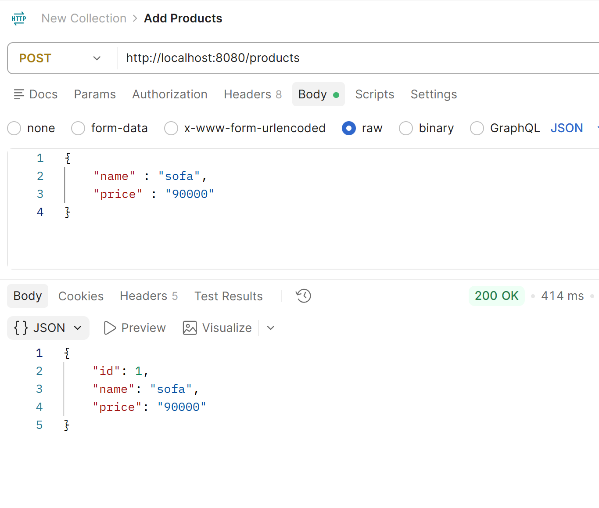
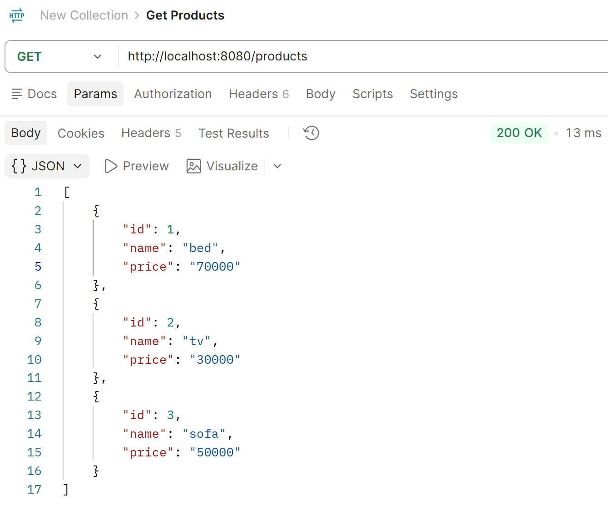
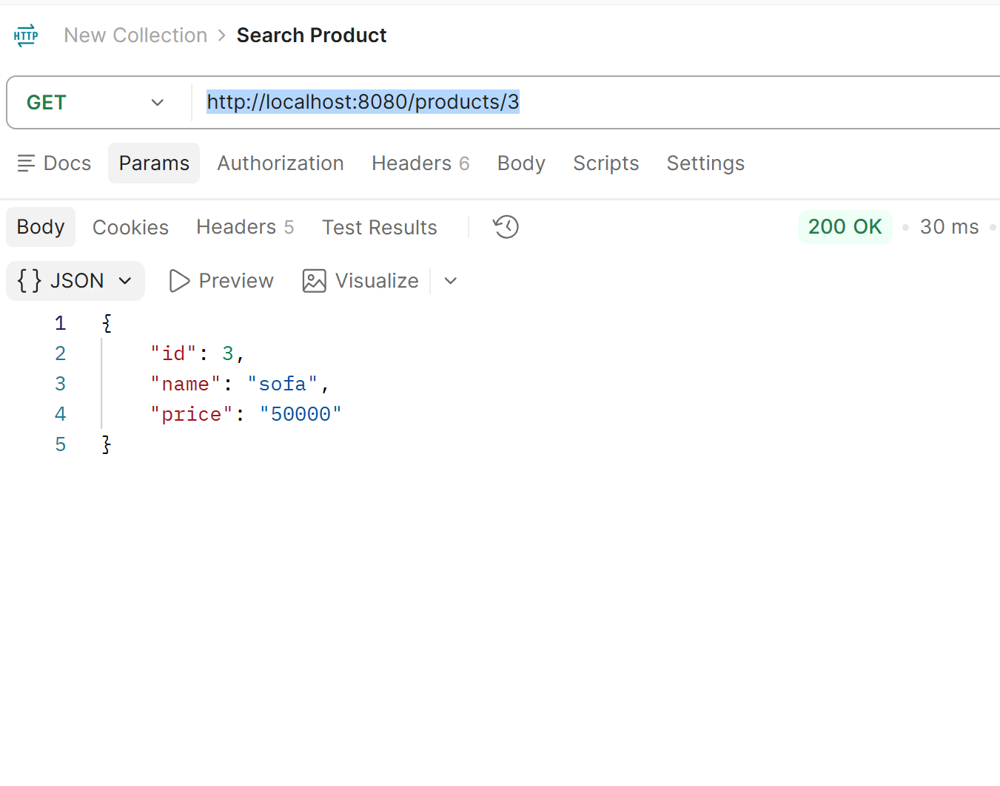
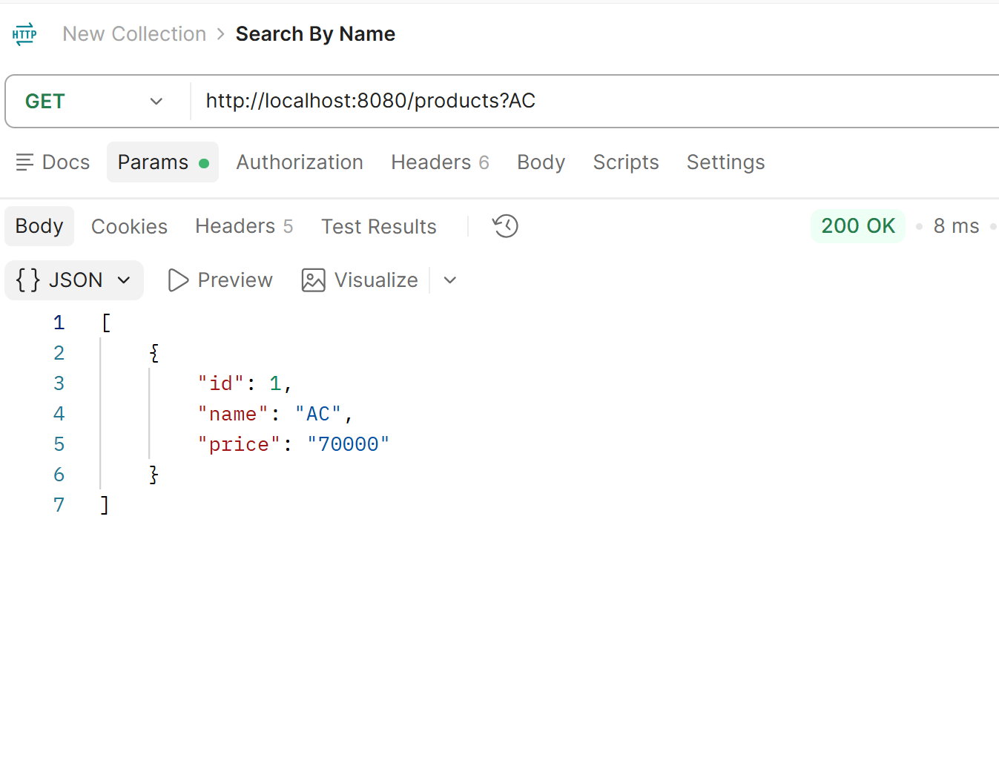
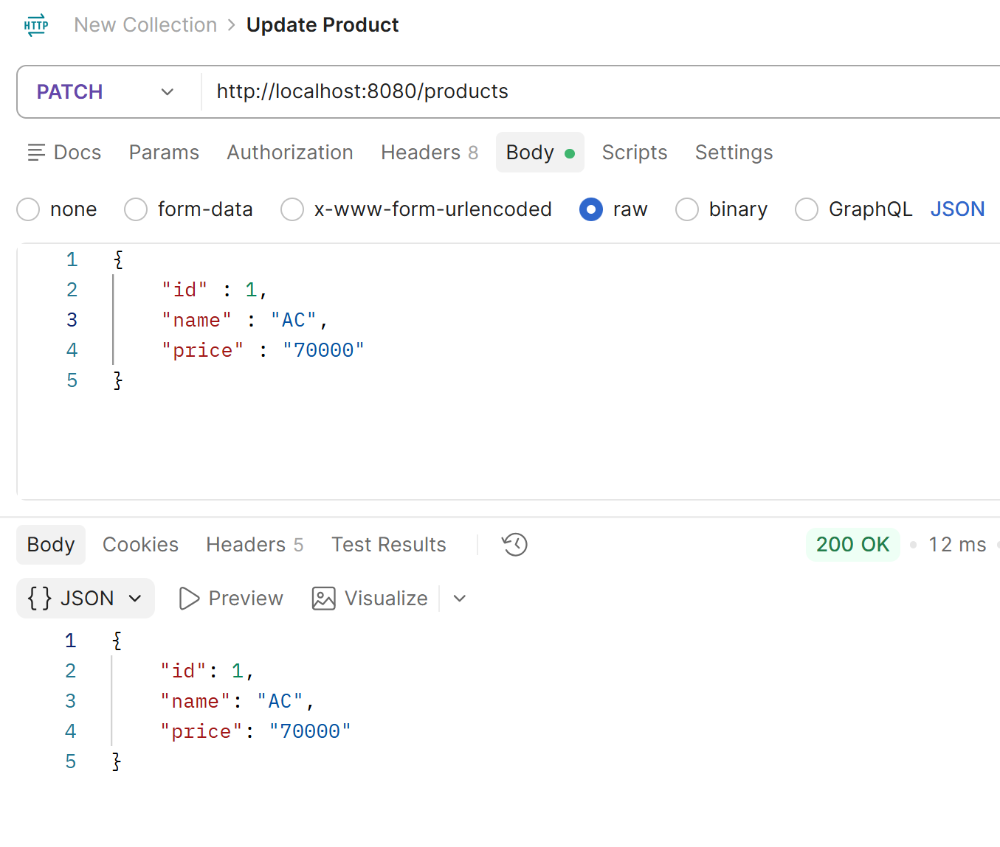
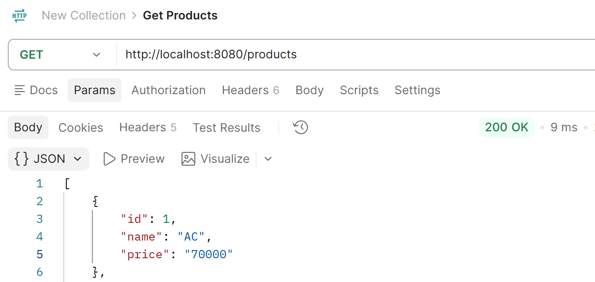
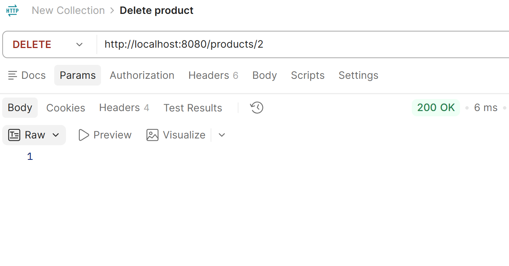
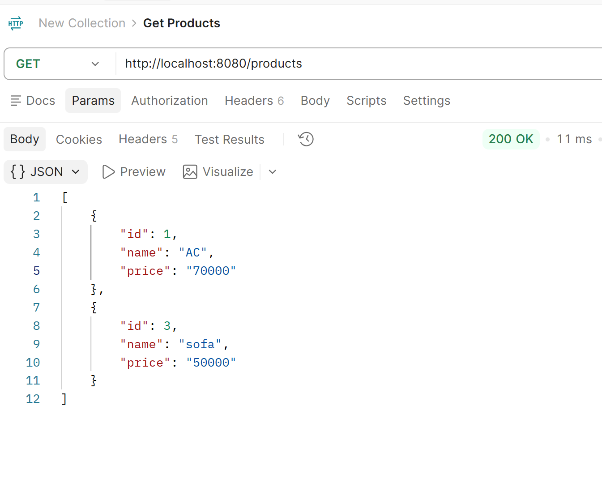
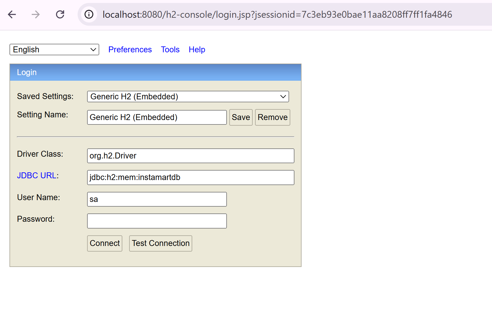
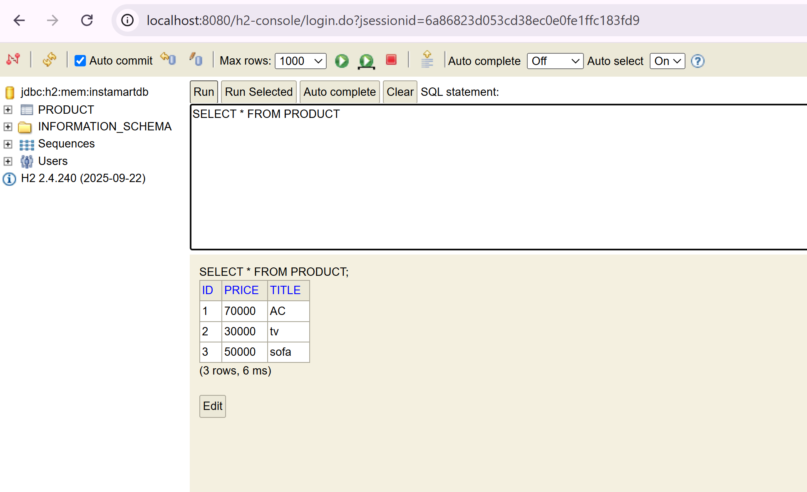

# 📦 Insta‑Mart

A Spring Boot project for managing products with RESTful APIs and an H2 in‑memory database.  
This project demonstrates how to build a simple e‑commerce backend with CRUD operations, search functionality, and database inspection via the H2 console.

---

## 🚀 Features
- **Home Endpoint**: Welcome message at `/home`
- **Product APIs**:
    - `GET /products` → Fetch all products
    - `POST /products` → Add a new product
    - `GET /products/{id}` → Search product by ID
    - `PATCH /products` → Update product
    - `DELETE /products/{id}` → Delete product
    - `GET /search-product?name=...` → Search product by name
- **Database**: H2 in‑memory DB with console enabled at `/h2-console`
- **Repository Layer**: Extends `JpaRepository` with custom finder `findByName`

---

## 🛠️ Tech Stack
- Spring Boot
- Spring Data JPA
- H2 Database
- Postman (API testing)
- IntelliJ IDEA

---

## ▶️ Setup & Run
1. Clone the repo:
   ```bash
   git clone https://github.com/<your-username>/insta-mart.git

2. Navigate into the project:
   ```bash
   cd insta-mart

3. Run the application:
   ```bash
   mvn spring-boot:run

4.Access endpoints:

  http://localhost:8080/products

  http://localhost:8080/h2-console

📖 Example JSON

Add Product Request:

{
"name": "sofa",
"price": "90000"
}

Response:

{
"id": 1,
"name": "sofa",
"price": "90000"
}


📸 Screenshots

### Add Product (Postman)


### Get Product (Postman)


### Search Product By ID (Postman)


### Search Product By Name (Postman)


### Update Product (Postman)


### Get Product After Update(Postman)


### Delete Product (Postman)


### Get Product After Delete(Postman)


### H2 Console


### H2 Database


👉 Just copy this into a `README.md` file in your project root.  